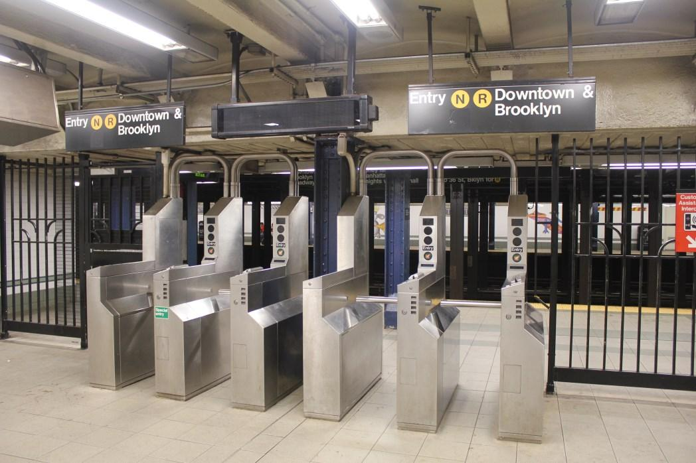

# PROJECT-1 at METIS Data Science Bootcamp
Exploratory Data Analysis (EDA) of MTA Turnstile Data

**Project Description:**  
_WomenTechWomenYes (WTWY) has an annual gala at the beginning of the summer each year. As we are new and inclusive organization, we try to do double duty with the gala both to fill our event space with individuals passionate about increasing the participation of women in technology, and to concurrently build awareness and reach._  

_To this end we place street teams at entrances to subway stations. The street teams collect email addresses and those who sign up are sent free tickets to our gala._

_Where we’d like to solicit your engagement is to use MTA subway data, which as I’m sure you know is available freely from the city, to help us optimize the placement of our street teams, such that we can gather the most signatures, ideally from those who will attend the gala and contribute to our cause._

_Best,_   
_WTWY International_  

**Project Goal:**
1. Examine New York City Turnstile data (and other necessary data)
2. Identify best locations to send WTWY street teams, to collect signatures and email addresses (to which free Gala tickets will be sent)  

  
Photo from [nycsubwayguide](http://www.nycsubwayguide.com/subway/step_by_step_guide.aspx)  

**Project Requirement:**
1. Use `Python` and `Pandas` for data analysis
2. Use `Matplotlib` and `seaborn` for visualization

**Project Deliverables:**
- [x] Group presentation and slides
- [x] Project repository containing codes and necessary data  

---

JSP-Analytic **Team Members**:
1. Jhonsen Djajamuliadi: [LinkedIn](https://www.linkedin.com/in/djajamuliadi/), [Github](https://github.com/jhonsen)
2. Sharmila Muralidharan [LinkedIn](https://www.linkedin.com/in/sharmilamuralidharan/), [Github](https://github.com/Sharmila8)
3. Po-Yan Tsang: [LinkedIn](https://www.linkedin.com/in/po-yan-tsang/), [Github](https://github.com/pytgit)

JSP-Analytic **Approach**:
1. Collected MTA Turnstile Data and other supplementary info (e.g., census data with zip codes and median income)
2. Scraped zip codes and geo coordinates from google api, and merged them with the mta data
3. Performed exploratory data analysis:
    - Targeted top 10 busiest stations (out of 379 stations in dataset)
    - Removed outliers and inconsistent turnstile readings
    - Identified subway stations located in NYC areas with highest median income  
4. Created dataset visualizations to identify the best: locations, months, days and times for street teams to operate  
5. Provided recommendations based on EDA results  

JSP-Analytic **Recommendations**:
1. Street teams should go out between April and June
2. Teams should target top 10 busiest stations, among which 5 are high-income areas (that may target potential donors for the gala)
3. Weekdays and daytime are best for gaining most signatures

---

**Description of codes and dataset:**
1. *Turnstile_Usage_Data__2018.csv*: MTA 2018 turnstile data can be obtained from [data.gov](https://catalog.data.gov/dataset/turnstile-usage-data-2018) This dataset is excluded from this repo, because it exceeds the file size limit of github.
2. *code/EDA_MTA.ipynb*: (main) jupyter notebook describing exploratory analysis of turnstile data   
3. *code/MTAData.py*: python script takes in MTA subway station geo codes from [data.gov](https://catalog.data.gov), and utilize **Google Places API** to find the corresponding zip code for the MTA subways stations and output the results to _data/subwayszip.csv_ file
4. *code/MTAwIncome.ipynb*: jupyter notebook on subway zipcode data (_subwayszip.csv_ file) and census income data per zipcode (_NYC Median Income by Zipcode.csv_)  to determine the median income for top 10 stations with most traffic as determined from _EDA_MTA.ipynb_
5. *code/EDA_Gender.ipynb*: jupyter notebook on the analysis of gender in NYC areas, sorted by zip codes
6. *code/EDA_Map.ipynb*: jupyter notebook for interactive, exploratory map analysis of NYC subway station locations
7. *code/EDA_zipcode*: jupyter notebook on cleaning zip codes and station information, used for mapping (above)
8. *data/NYC Median Income by Zipcode.csv*: Census data with median household income by zip code from [factfinder](https://factfinder.census.gov/faces/nav/jsf/pages/index.xhtml)
9. *data/DOITT_SUBWAY_STATION_01_13SEPT2010.csv*: list of MTA subway stations with geo codes data from [data.gov](https://catalog.data.gov)
10. *data/Nyc_Gender_data_by_zipcodes_femaile.csv*: data set of male and female population in NYC by zip codes
11. *data/subwayszip.csv*: data containing geo codes of subway stations
12. *data/top_stations.csv*: data set describing top 10 stations with highest income by zip codes
13. *summary/Project Benson - Team JSP.pdf (pptx)*: oral presentation slides

**Additional Tools and APIs**:
1. [Plotly](https://plot.ly/)
2. [Mapquest](https://www.mapquest.com/)
3. [Google Maps](https://cloud.google.com/maps-platform/)
